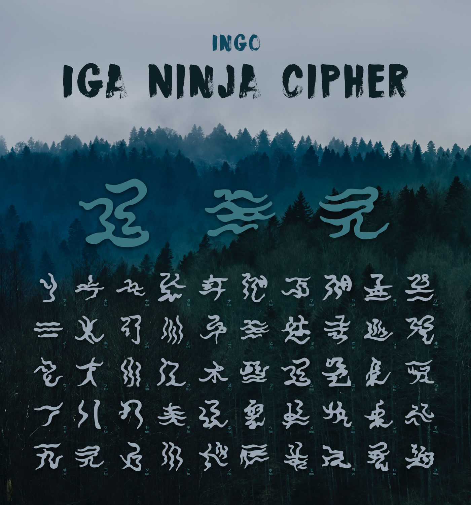

# Iga Ninja Font – Cipher from Iga

The Iga Ninja Font was created by [Stefan Imhoff] of an image provided by the Iga Ninja Museum in Japan and is said to be a font for correspondence in cipher. The font can be downloaded on [kogakure.de] or from this repository.

## Contents

This repository contains the OTF font, individual SVG, and an image with all characters, and the [Glypr Studio](http://www.glyphrstudio.com/) project file.

## The Font

The font is a historical font, why only Katakana are provided and some characters (e. g. ン) and diacritics are missing and instead some older characters are part of the font.

## Licence

The font is provided under a licence of [Creative Commons Attribution-NonCommercial 3.0 Unported] (CC BY-NC 3.0).

  [Stefan Imhoff]: https://stefanimhoff.de
  [kogakure.de]: https://kogakure.de
  [Creative Commons Attribution-NonCommercial 3.0 Unported]: http://creativecommons.org/licenses/by-nc/3.0/
